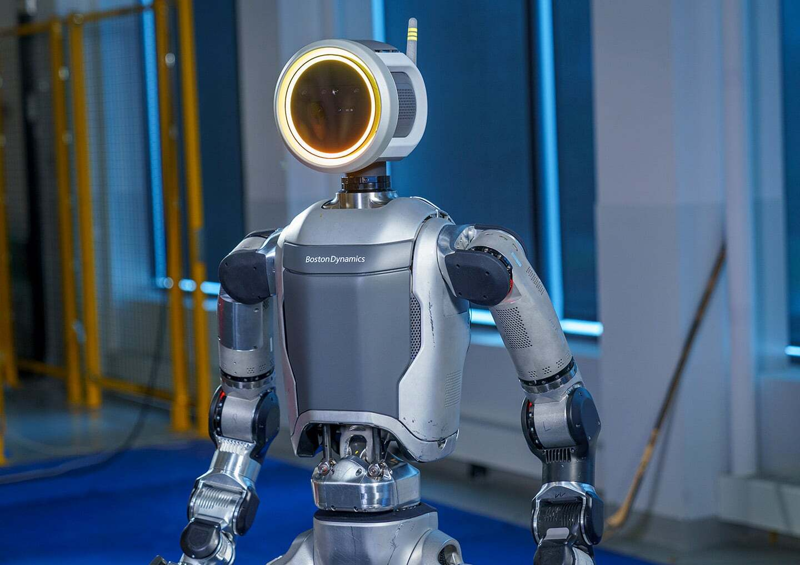

## e-Atlas Prototype

On April 17th, 2024, Boston Dynamics released a video announcing an all new, fully electric Atlas, just a day after announcing the retirement of its hydraulicly actuated HD Atlas.

On January 5th during a Hyundai keynote presentation at CES 2026, Boston Dynamics unveiled a product version of Atlas. This is apparently the simplest robot that they have ever made and is designed for manufacturability first. As of early 2026, Hyundai plans on building a purpose built factory for building Atlas robots by 2028, with a capacity of 30,000 robots a year.

https://www.youtube.com/watch?v=29ECwExc-_M

As you can see in the announcment video, Atlas now has something called hypermobility, meaning some joints are capable of rotating 360 degrees continuously. This new flexibility is enabled by slip rings placed at joints that are meant to be continuous, such as the head and torso. Apparently, many of Atlas' joints are continuous.

A new torso design allows Atlas to lean forward and side to side, adding flexibility to the abdomen. You can see this in action when Atlas squats down to pick things up that are low to the ground. The mechanical design of this joint is similar to Figure's 01 robot. The top and bottom half of the body are connected by a uninversal joint, then driven by two motors configured in a differntial pair. So when both motors contract, Atlas will lean forward. If the motors are activated in oposite directions, it will lean to the side where the motor is contracting.

https://www.youtube.com/watch?v=F_7IPm7f1vI

### Hand (GR2)

7 DoF

## e-Atlas Product

The product version of Atlas is largely simplified from the prototype, but there are major differences. Atlas stands at 1.9 m, weighs 90 kg, and has a reach of 2.3 m high. It can lift 50 kg at it's peak and 30 kg sustained. With one hand it can lift 20 kg. It has 56 degrees of freedom (DoF), with most of it's joints have continuous rotation using slip rings.

https://www.youtube.com/watch?v=rrUHZKlrxms

The head, otherwise known as the "Atlas Control System", contains four camera modules, each with two cameras, on all four sides, creating a 360 degree view of the robot's surroundings. It also holds the compute module for the entire robot, meaning that when better computing hardware is released, you only need to replace the head, installing it on the same body. You can also remove the head and use it as a development computer, say for example keeping it on your desk to work on routines.

The body, also known as the "Atlas Bimanual Manipulator", consists of the torso, legs, and arms. The torso contains dual self swappable batteries for continuous operation. Swapping both batteries takes 3 minutes. Once batteries are removed, it takes 1.5 hours to fully charge them. Under normal operating conditions, Atlas can operate for approximately 4 hours before battery depletion, and 2 hours while lifting heavy items.

Carrying handles are integrated into the upper and lower back to move the robot when powered off. Located between the top handles is the power connector, ethernet connector, and the power button.

Atlas' hands have four fingers, each with tactile sensors, along with the palm. A barcode scanner in the top of the hand allows it to keep track of the items it is handling.

https://www.youtube.com/watch?v=hYRG6kHbYKI&t=1172

### Hand (GR3)

13 DoF