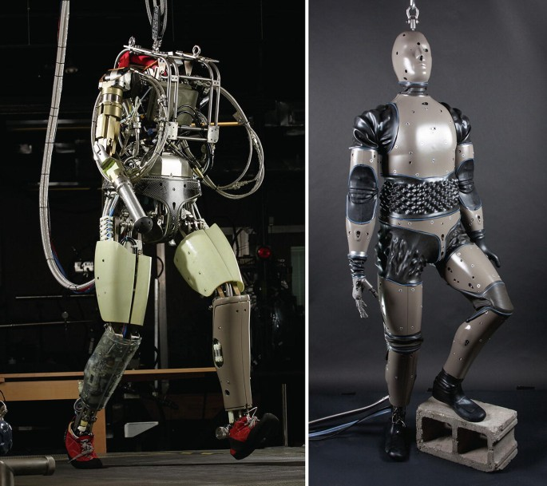

## PETMAN

Announced on April 20th, 2009, the US Army contracted Boston Dynamics to design an anthropomorphic robot to test chemical protection clothes as a part of the PETMAN project. PETMAN is an acronym that stands for Protection Ensemble Test MANnequin. Some of the requirements for PETMAN's development were to be able to walk, crawl, squat, and other dynamic physical movements an average soldier would be doing. With $26.3M, a 13 month design phase and 17 month build, installation and validation phase, PETMAN was set to be completed in 2011.

### PETProto

https://www.youtube.com/watch?v=67CUudkjEG4

Before we talk any more about PETMAN, we need to talk about what came before it.

PETProto is a close relative to Big Dog, having many of the underlying technologies repurposed. Like Big Dog, PETProto is hydraulicly actuated. However, unlike Big Dog, it is not powered by a gasoline go cart engine, but instead tethered to an electric power source.

In keeping with the similarities, Big Dog and PETProto share the same legs. The proportions had semantically shifted, where the ankle and knee on Big Dog now became the knee and hip on PETProto.

### Hardware

https://www.youtube.com/watch?v=mclbVTIYG8E

One of the main build requirements from the Army was for PETMAN to have the ability to sweat. Working with a subcontractor, Measurement Technology Northwest, PETMAN was fitted with a synthetic mannequin skin that can sweat.

https://www.youtube.com/watch?v=tFrjrgBV8K0
